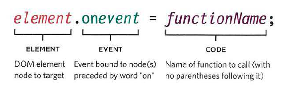
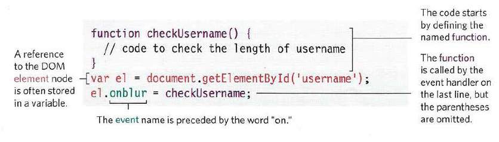
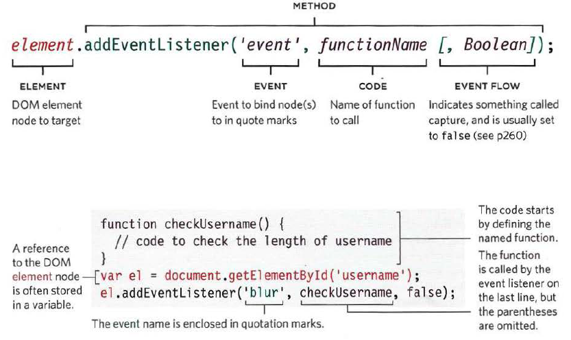

# Read 09 Notes

**HTML Book**  
Chapter 7: “Forms” (p.144-175)
Chapter 14: “Lists, Tables & Forms” (pp.330-357)

**JS Book**  
Chapter 6: “Events” (pp.243-292)

## Forms

Elements & Attributes to be familiar with: 

`<form>` 
- action = 
- methods= "" (get or post)
- name = ""
- maxlength = ""
- 

`<input>`
- type = "text"
- type = "password"
- type = "radio"

`<textarea>`

## Events

- Interactions create events
- Events Trigger code
- Code Responds to users 

When an event has occured, it is described as having fired or been raised. Then the event triggers functions or scripts

Different types of Events

Event Handling 
1. Select the element node you want the script to respond to
1. Indicate which event on the selected node(s) will trigger the response. Called binding an event to a DOM node. 
1. State code you want to run when the event occurs

Three ways to Bind Event to an element
- HTML Event Handlers - do not use. used in old code and is bad practice
- Traditional DOM Event Handlers
- DOM level 2 Event Listeners

**Tradition DOM event Handlers**
- can only attach one function to each event handler

**Event Listeners**

If you have to use parameters in a function, you must wrap function in anonymous function. 

[Back to Table of Contents](https://davees987.github.io/reading-notes)