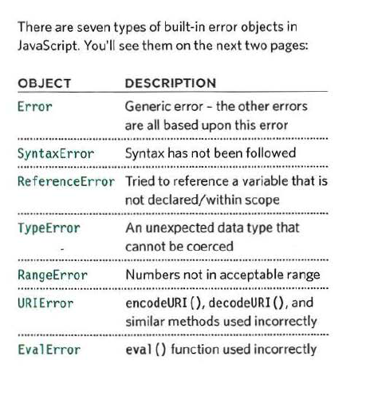
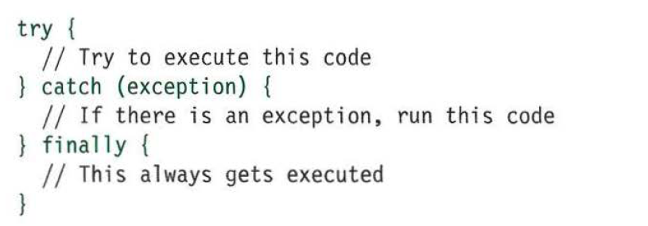

# Read 10 Notes

**JS Book**    
Chapter 10: “Error Handling & Debugging” (pp.243-292)

Every statement in a script lives in one of three execution contexts
- Global - there is only one global context in any page
- function - 
- eval (not discussed in book)

### Common Error Objects

Console messages to be familiar with  

- console.info()
- console.warn()
- console.error()
- console.group()
- console.table()
- console.assert()

Keywords to be familiar with
- debugger
- `throw new Error('message');`

Handling Exceptions

